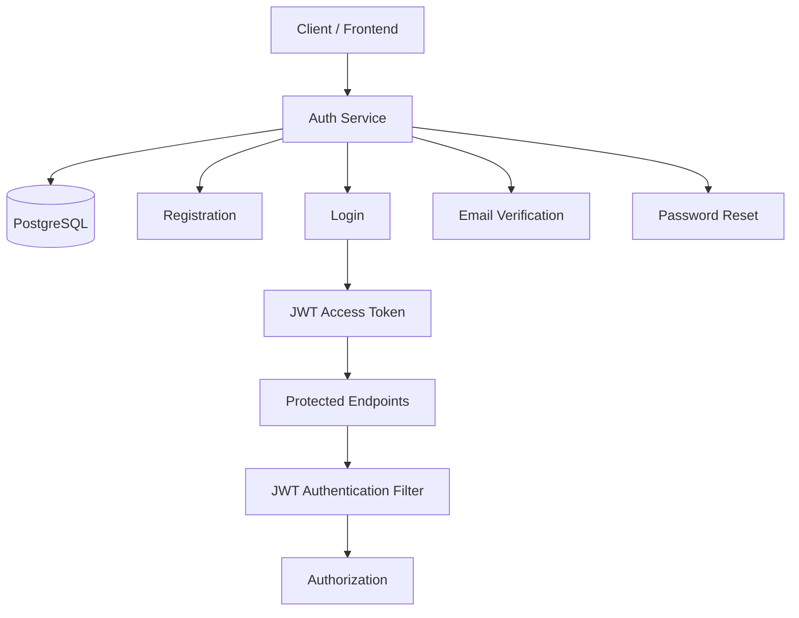
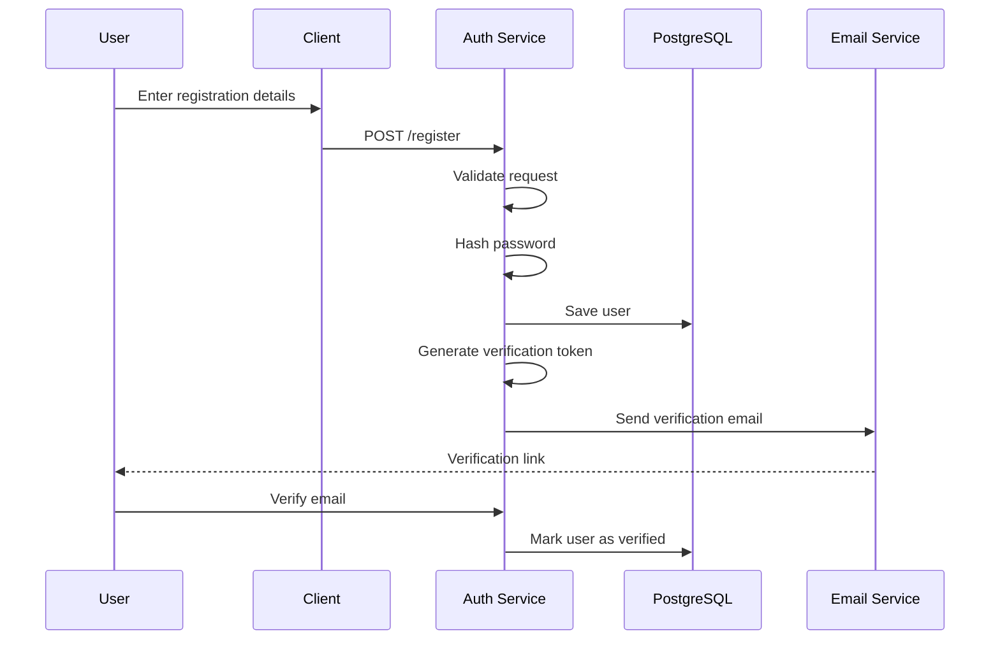
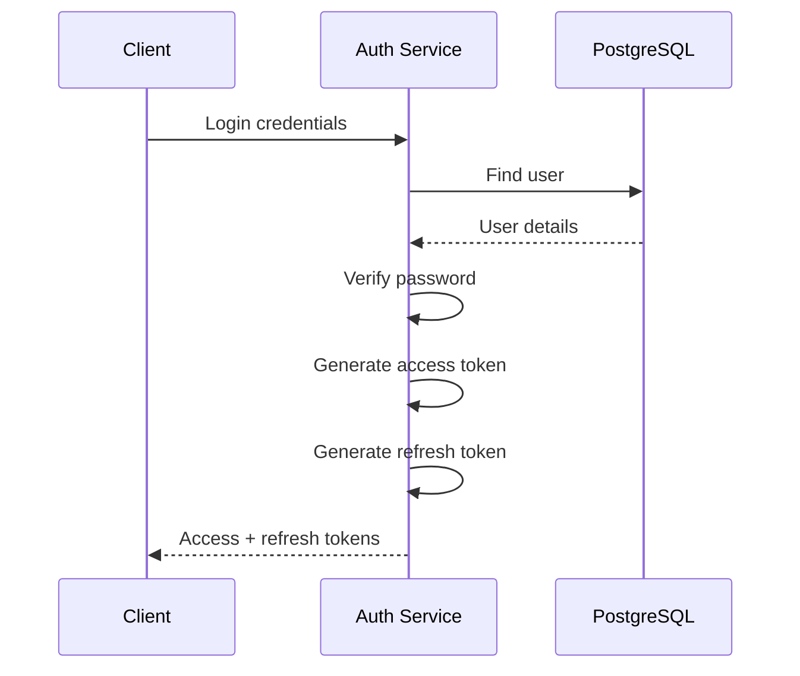
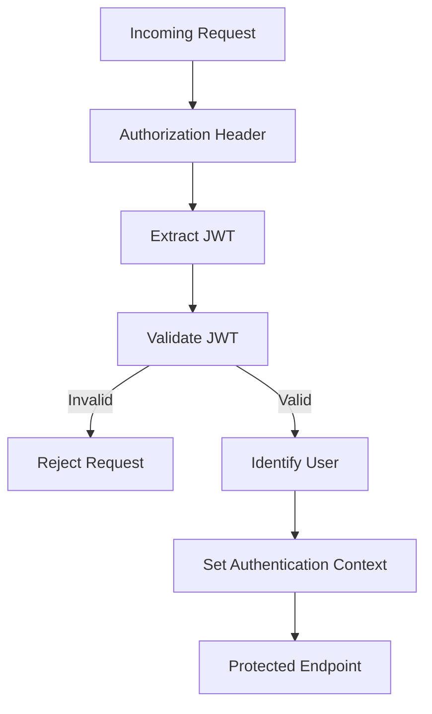
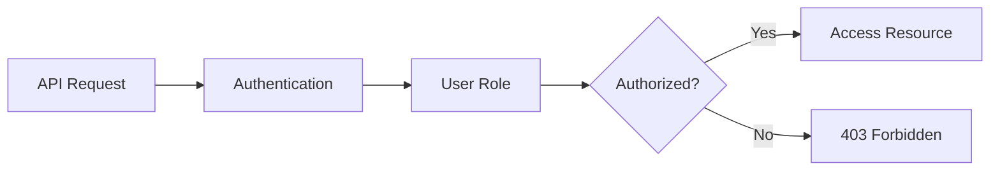
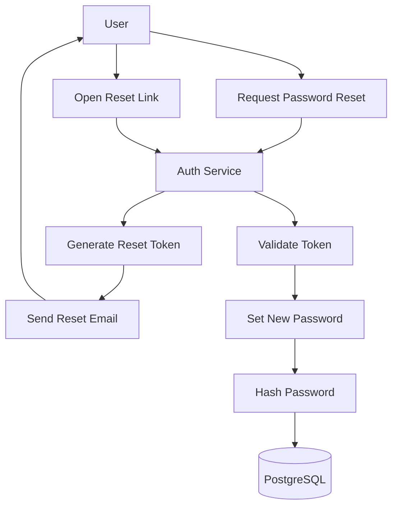

# Authentication-Service

A standalone authentication service built with **Spring Boot** and **PostgreSQL** for use with my e-commerce application.

The service handles user authentication and account security, including registration, email verification, login, JWT authentication, refresh tokens, authorization, and password reset.

## Features

* User registration
* Password hashing
* Email verification
* User login
* JWT-based authentication
* Access and refresh tokens
* Protected API endpoints
* Role-based authorization
* Password reset
* Token expiration

## Tech Stack

* Spring Boot(Java)
* PostgreSQL

## Authentication Architecture

The authentication service sits between the client and the authentication database.



## User Registration

When a new user registers:

1. The client sends the user's registration details to the Auth Service.
2. The service validates the request.
3. The password is hashed.
4. The user is stored in PostgreSQL.
5. A verification token is generated.
6. A verification email is sent to the user.
7. The user verifies their email through the verification link.



## Password Security

Passwords are **never stored as plain text**.

During registration, the submitted password is hashed before being stored in the database.

During login, the submitted password is compared against the stored password hash rather than comparing plain-text passwords.

## Email Verification

New accounts must be verified through email before they can be fully authenticated.

Verification tokens are temporary and expire after a configured period.

## User Login

After successfully verifying their account, a user can log in using their credentials.



## JWT Authentication

The service uses **JSON Web Tokens (JWTs)** to authenticate requests to protected endpoints.

After a successful login, the client receives an access token.

The client then sends the token with subsequent authenticated requests.

```text
Authorization: Bearer <access-token>
```

The JWT contains information that identifies the authenticated user and is cryptographically signed by the Auth Service.

## Protecting API Endpoints

Requests to protected endpoints pass through the JWT authentication filter.



## Access Tokens and Refresh Tokens

The service uses two types of tokens:

| Token         | Purpose                            |
| ------------- | ---------------------------------- |
| Access Token  | Used to access protected endpoints |
| Refresh Token | Used to obtain a new access token  |

Access tokens have a shorter lifetime, while refresh tokens remain valid for longer.

This allows the application to maintain a user's session without requiring the user to log in again whenever an access token expires.

## Authorization

Authentication answers:

> **Who are you?**

Authorization answers:

> **What are you allowed to access?**

After a user has been authenticated, the application can use their roles or permissions to determine whether they are allowed to access a particular resource.

For example:



## Password Reset

Users can request a password reset if they forget their password.



Reset tokens are temporary and expire after a configured period.


## E-Commerce Integration

The Auth Service is intended to be used as a separate authentication service for my e-commerce application.

```mermaid
flowchart LR
    User[User] --> Frontend[thirdparty  Frontend]

    Frontend --> Auth[Auth Service]
    Frontend --> Third-party App Backend

    Auth --> AuthDB[(Auth Database)]

    Ecommerce --> Products[Products / Orders / Other Resources]

    Auth -. Authentication .-> Third-party app
```

The Auth Service is responsible for authentication-related functionality, while the third party backend can focus on the application's core business logic.


## Project Purpose

This project was built as a reusable authentication service for a third party application while exploring how authentication can be designed as a separate backend service.

It demonstrates the complete authentication lifecycle—from **user registration and email verification to login, JWT authentication, authorization, token refresh, and password recovery**.
